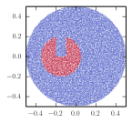
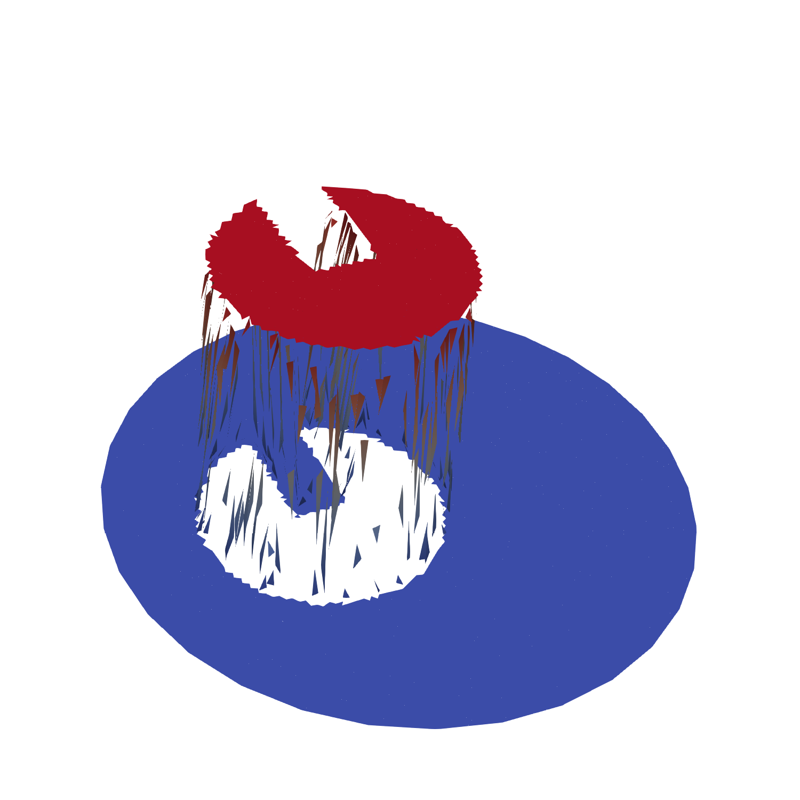
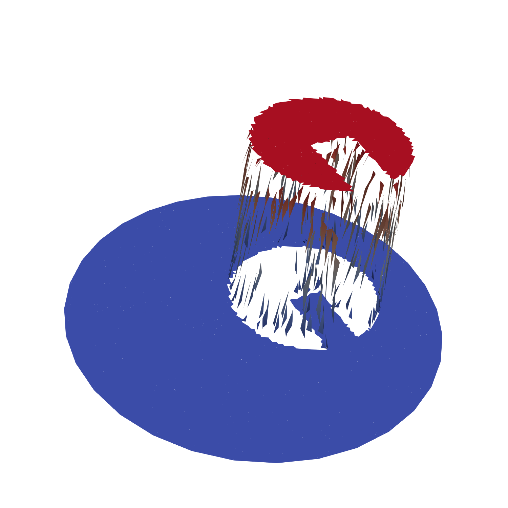

Getting started
===============

For illustration purpposes, let's go step by step through a simple example where a slotted
disk rotates through a (circle-shaped) mesh. The rotation of the slotted disk is governed by the
solid body rotation

.. math::

    \mathbf{u} = \pi[-y, x]^\top

The slotted disk is represented on a set of particles, see the following picture of what could be
the initial particle field.

Our objective is to project the scattered particle representation of the (rotating!) slotted disk
onto a FEM mesh in such a way that the area is preserved (i.e. mass conservation).
Apart from conservation, we certainly want the particle-mesh projection to be accurate
as well. To achieve this, the PDE-constrained particle-mesh projection from
`Maljaars et al [2019] <https://doi.org/10.1016/j.cma.2019.01.028>`_ is used. This projection is derived from the
Lagrangian functional

.. math::

    \mathcal{L}(\psi_h, \bar{\psi}_h, \lambda_h)
    =
    \sum_{p}^{} \frac{1}{2}\left( \psi_h(\mathbf{x}_p(t), t) - \psi_p(t)\right)^2
    +
    \sum_{K}^{} \oint_{\partial K}{\frac{1}{2}\beta \left( \bar{\psi}_h - \psi_h \right)^2}
    +
    \sum_{K}^{} \int_{K}{\frac{1}{2} \zeta || \nabla \psi_h ||^2}
    \\
    +
    \int_{\Omega}{\frac{\partial \psi_h}{\partial t}\lambda_h }
    -
    \sum_{K}^{} \int_{K}{ \mathbf{a} \psi_h \cdot \nabla{\lambda_h} }
        +
        \sum_{K}^{} \oint_{\partial K }{ \mathbf{a}\cdot \mathbf{n} \bar{\psi}_h \lambda_h}

An in-depth interpretation and analysis of this functional and the optimality system that
results after taking variations with respect to :math:`\left(\psi_h, \lambda_h, \bar{\psi}_h \right) \in \left(W_h, T_h, \bar{W}_{h} \right)`,
can be found in the aformentioned reference.

First, let's import the required tools from :code:`leopart`:

.. code-block:: python

    from leopart import (
        particles,
        advect_rk3,
        PDEStaticCondensation,
        FormsPDEMap,
        RandomCircle,
        SlottedDisk,
        assign_particle_values,
        l2projection,
    )

And import a number of tools from :code:`dolfin` and other libraries:

.. code-block:: python

    from dolfin import (
    Expression,
    Point,
    VectorFunctionSpace,
    Mesh,
    Constant,
    FunctionSpace,
    assemble,
    dx,
    refine,
    Function,
    assign,
    DirichletBC,
    )

    from mpi4py import MPI as pyMPI
    import numpy as np

    comm = pyMPI.COMM_WORLD

Next is to further specify the geometry of the domain and the slotted disk. Furthermore, we import the
disk-shaped mesh, which is refined twice in order to increase the spatial resolution

.. code-block:: python

    (x0, y0, r) = (0.0, 0.0, 0.5)
    (xc, yc, r) = (-0.15, 0.0)
    (r, rdisk) = (0.5, 0.2)
    rwidth = 0.05
    (lb, ub) = (0.0, 1.0)

    # Mesh
    mesh = Mesh("./../../meshes/circle_0.xml")
    mesh = refine(refine(refine(mesh)))

The slotted cylinder is created with the :code:`SlottedDisk` class, this is nothing more than just a
specialized :code:`dolfin.UserExpression` and provided in the :code:`leopart` package just for
convenience:

.. code-block:: python

    psi0_expr = SlottedDisk(
        radius=rc, center=[xc, yc], width=rwidth, depth=0.0, degree=3, lb=lb, ub=ub
    )

The timestepping parameters are chosen such that we precisely make one rotation:

.. code-block:: python

    Tend = 2.0
    dt = Constant(0.02)
    num_steps = np.rint(Tend / float(dt))

In order to prepare the PDE-constrained projection, the function spaces :math:`W_h`, :math:`T_h` and
:math:`\bar{W}_h` are defined. Note that :math:`\bar{W}_h` is defined only on the mesh facets. Apart
from the function space definitions, we also set a homogeneous Dirichlet boundary condition on
:math:`\bar{W}_h`, and we define the advective velocity field.

.. code-block:: python

    W = FunctionSpace(mesh, "DG", 1)
    T = FunctionSpace(mesh, "DG", 0)
    Wbar = FunctionSpace(mesh, "DGT", 1)

    bc = DirichletBC(Wbar, Constant(0.0), "on_boundary")

    (psi_h, psi_h0, psi_h00) = (Function(W), Function(W), Function(W))
    psibar_h = Function(Wbar)

    V = VectorFunctionSpace(mesh, "DG", 3)
    uh = Function(V)
    uh.assign(Expression(("-Uh*x[1]", "Uh*x[0]"), Uh=np.pi, degree=3))

We are now all set to define the particles. So we start with creating a set of point locations
and setting a scalar property that, for instance, defines the concentration. Note that :code:`leopart`
comes shipped with a number of particle generators, of which the :code:`RandomCircle` method is just
one.

.. code-block:: python

    x = RandomCircle(Point(x0, y0), r0).generate([750, 750])
    s = assign_particle_values(x, psi0_expr)

...and define both the particle object and a particle-advection scheme (in this case a Runge-Kutta 3
scheme)

.. code-block::

    p = particles(x, [s], mesh)
    ap = advect_rk3(p, V, uh, "closed")

The optimality system that results from minimizing the Lagrangian can be represented as a 3x3 block
matrix at the element level

.. math::
    
    \begin{bmatrix}
    \boldsymbol{M}_p + \boldsymbol{N} & \boldsymbol{G}(\theta) & \boldsymbol{L} \\
    \boldsymbol{G}(\theta)^\top   & \boldsymbol{0}   & \boldsymbol{H} \\
    \boldsymbol{L}^\top   & \boldsymbol{H}^\top & \boldsymbol{B}
    \end{bmatrix}
    \begin{bmatrix}
    \boldsymbol{\psi}^{n+1} \\
    \boldsymbol{\lambda}^{n+1} \\
    \boldsymbol{\bar{\psi}}^{n+1} \\
    \end{bmatrix}
    =
    \begin{bmatrix}
    \boldsymbol{\chi}_p \boldsymbol{\psi}_p^{n} \\
    \boldsymbol{G}(1-\theta)^\top \boldsymbol{\psi}^{n} \\
    \boldsymbol{0}\\
    \end{bmatrix},

The ufl-forms for the different contributions in this algebraic problem can be obtained with the
:code:`FormsPDEMap` class. Furthermore, we feed these forms into the :code:`PDEStaticCondensation`
class that will be used for the acutal projection:

.. code-block::

    zeta = Constant(30.0)
    FuncSpace_adv = {"FuncSpace_local": W, "FuncSpace_lambda": T, "FuncSpace_bar": Wbar}
    forms_pde = FormsPDEMap(mesh, FuncSpace_adv).forms_theta_linear(
        psi_h0, uh, dt, Constant(1.0), zeta=zeta, h=Constant(0.0)
    )
    pde_projection = PDEStaticCondensation(
        mesh,
        p,
        forms_pde["N_a"],
        forms_pde["G_a"],
        forms_pde["L_a"],
        forms_pde["H_a"],
        forms_pde["B_a"],
        forms_pde["Q_a"],
        forms_pde["R_a"],
        forms_pde["S_a"],
        [bc],
        1,
    )

Note that in the snippet above, the :math:`\zeta` parameter which penalizes over and
undershoot is set to a value of 30. Other than scaling this parameter with the
approximate number of particles per cell, there is (as yet) not much more intelligence behind it).

We are almost ready for running the advection problem, the only thing which we need is an initial
condition for :math:`\psi_h` on the mesh. In order to obtain this mesh field from the particles,
the bounded :math:`\ell^2` projection that is available in :code:`leopart` is used, i.e.

.. code-block:: python

    lstsq_psi = l2projection(p, W, 1)

    lstsq_psi.project(psi_h0, lb, ub)
    assign(psi_h00, psi_h0)

This results in the initial mesh field as shown below:

Now we are ready to enter the time loop and solve the PDE-constrained projection in every time step
for reconstructing a conservative mesh field :math:`\psi_h` from the moving particle field.

.. code-block:: python

    step = 0
    t = 0.0
    area_0 = assemble(psi_h0 * dx)

    while step < num_steps:
        step += 1
        t += float(dt)

        if comm.Get_rank() == 0:
            print(f"Step {step}")

        ap.do_step(float(dt))

        pde_projection.assemble(True, True)
        pde_projection.solve_problem(psibar_h, psi_h, "mumps", "default")

        assign(psi_h0, psi_h)

Finally, we want to check if we indeed can keep our promise of being conservative and accurate, so
let's check by printing:

.. code-block:: python

    area_end = assemble(psi_h * dx)
    num_part = p.number_of_particles()
    l2_error = np.sqrt(abs(assemble((psi_h00 - psi_h) * (psi_h00 - psi_h) * dx)))
    if comm.Get_rank() == 0:
        print(f"Num particles {num_part}")
        print(f"Area error {abs(area_end - area_0)}")
        print(f"L2-Error {l2_error}")

That's all there is! The code for running this example can be found on `Bitbucket <https://bitbucket.org/jakob_maljaars/leopart/src/master/tests/scalar_advection/SlottedDisk_rotation_PDE.py>`_. Just to 
convince you that it works, this is the reconstructed mesh field at :math:`t=1`, after a half rotation:

